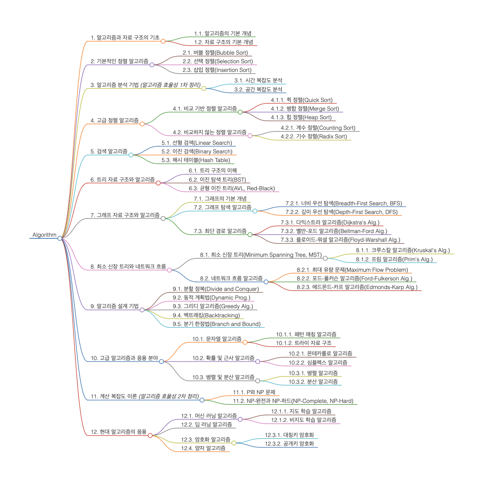

## 1. 알고리즘과 자료 구조의 기초
>
* 알고리즘과 자료 구조의 기본적인 개념을 배웁니다.
* 알고리즘의 학습 목적을 배웁니다.
### 1.1. 알고리즘의 기본 개념
### 1.2. 자료 구조의 기본 개념

## 2. 기본적인 정렬 알고리즘
>
* 기본적인 정렬 알고리즘을 배웁니다.
* 세 개의 알고리즘이 나타난 이유와 과정을 배웁니다.
### 2.1. 버블 정렬(Bubble Sort)
### 2.2. 선택 정렬(Selection Sort)
### 2.3. 삽입 정렬(Insertion Sort)

## 3. 알고리즘 분석 기법_(알고리즘 효율성 1차 정리)_
>
* 알고리즘의 효율성을 객관적으로 평가하는 방법을 배웁니다.
### 3.1. 시간 복잡도 분석
### 3.2. 공간 복잡도 분석

## 4. 고급 정렬 알고리즘
>
* 고급 정렬 알고리즘을 배웁니다.
* 효율성의 필요성을 대두로 분할 정복의 과정을 배웁니다.
* 동일한 난제를 잇따라 자료 구조의 활용을 배웁니다.
* 비교의 과정을 벗어난 정렬 알고리즘을 배웁니다.
### 4.1. 비교 기반 정렬 알고리즘
#### 4.1.1. 퀵 정렬(Quick Sort)
#### 4.1.2. 병합 정렬(Merge Sort)
#### 4.1.3. 힙 정렬(Heap Sort)
### 4.2. 비교하지 않는 정렬 알고리즘
### 4.2.1. 계수 정렬(Counting Sort)
### 4.2.2. 기수 정렬(Radix Sort)

## 5. 검색 알고리즘
>
* 검색 알고리즘을 배웁니다.
* 단순한 검색이 아닌, 다양한 방법으로 검색하는 방법을 배워 정렬 및 삽입 알고리즘에 활용합니다.
* 추가로 더 빠른 데이터 접근과 처리가 가능한 해시 테이블 자료 구조와, 이를 통한 알고리즘을 배웁니다.
### 5.1. 선형 검색(Linear Search)
### 5.2. 이진 검색(Binary Search)
### 5.3. 해시 테이블(Hash Table)

## 6. 트리 자료 구조와 알고리즘
>
* 트리 자료 구조와 알고리즘을 배웁니다.
* 검색과 정렬의 효율성을 높여 알고리즘을 구현합니다.
### 6.1. 트리 구조의 이해
### 6.2. 이진 탐색 트리(BST)
### 6.3. 균형 이진 트리(AVL, Red-Black)

## 7. 그래프 자료 구조와 알고리즘
>
* 그래프 자료 구조와 알고리즘을 배웁니다.
* 연결 요소를 파악하는 기본 그래프 탐색 알고리즘을 배웁니다.
* 최단 경로로 갈 갈 수 있는 효율적 경로 탐색 알고리즘을 배웁니다.
### 7.1. 그래프의 기본 개념
### 7.2. 그래프 탐색 알고리즘
#### 7.2.1. 너비 우선 탐색(Breadth-First Search, BFS)
#### 7.2.2. 깊이 우선 탐색(Depth-First Search, DFS)
### 7.3. 최단 경로 알고리즘
#### 7.3.1. 다익스트라 알고리즘(Djikstra's Alg.)
#### 7.3.2. 벨만-포드 알고리즘(Bellman-Ford Alg.)
#### 7.3.3. 플로이드-워셜 알고리즘(Floyd-Warshall Alg.)

## 8. 최소 신장 트리와 네트워크 흐름
>
* 네트워크 설계 시 비용을 최소화하기 위해 개발된 최소 신장 트리를 배웁니다.
* 이를 통한 네트워크 흐름 알고리즘을 배웁니다.
### 8.1. 최소 신장 트리(Minimum Spanning Tree, MST)
#### 8.1.1. 크루스칼 알고리즘(Kruskal's Alg.)
#### 8.1.2. 프림 알고리즘(Prim's Alg.)
### 8.2. 네트워크 흐름 알고리즘
#### 8.2.1. 최대 유량 문제(Maximum Flow Problem)
#### 8.2.2. 포드-풀커슨 알고리즘(Ford-Fulkerson Alg.)
#### 8.2.3. 에드몬드-카프 알고리즘(Edmonds-Karp Alg.)

## 9. 알고리즘 설계 기법
>
* 다양한 문제를 광범위하고 효율적으로 해결하기 위한 알고리즘 설계 기법을 배웁니다.
* 큰 문제를 작은 문제로 분할하는 분할 정복을 배웁니다.
* 중복 계산을 피하고 최적해를 찾는 동적 계획법을 배웁니다.
* 국소 최적해를 통해 전역 최적해를 빠르게 찾는 그리디 알고리즘을 배웁니다.
* 모든 가능한 해를 탐색하되, 불필요한 경로를 제거하는 백트래킹을 배웁니다.
* 분기를 한정시켜, 쓸데없는 시간 낭비를 줄이는 분기 한정법을 배웁니다.
### 9.1. 분할 정복(Divide and Conquer)
### 9.2. 동적 계획법(Dynamic Prog.)
### 9.3. 그리디 알고리즘(Greedy Alg.)
### 9.4. 백트래킹(Backtracking)
### 9.5. 분기 한정법(Branch and Bound)

## 10. 고급 알고리즘과 응용 분야
>
* 텍스트 데이터 처리 및 중요성에 따른 문자열 알고리즘을 배웁니다.
* 최적해의 근접한 해를 빠르게 찾는 확률 및 근사 알고리즘을 배웁니다.
* 멀티코어 프로세서와 분산 시스템의 등장으로 병렬 처리가 가능함에 따라, 병렬 및 분산 알고리즘을 배웁니다.
### 10.1. 문자열 알고리즘
#### 10.1.1. 패턴 매칭 알고리즘
#### 10.1.2. 트라이 자료 구조
### 10.2. 확률 및 근사 알고리즘
#### 10.2.1. 몬테카를로 알고리즘
#### 10.2.2. 심플렉스 알고리즘
#### 
### 10.3. 병렬 및 분산 알고리즘
#### 10.3.1. 병렬 알고리즘
#### 10.3.2. 분산 알고리즘

## 11. 계산 복잡도 이론_(알고리즘 효율성 2차 정리)_
>
* 일부 문제에서 효율적인 알고리즘이 존재하지 않음을 알고 새로운 이론을 배웁니다.
* 해결이 어려운 문제를 NP-완전 문제를 통해 분류합니다.
* 그러나, 근사해를 찾는 알고리즘에서의 효율성 계산 한계를 이해합니다.
### 11.1. P와 NP 문제
### 11.2. NP-완전과 NP-하드(NP-Complete, NP-Hard)

## 12. 현대 알고리즘의 응용
>
* 빅데이터 시대에 따른 데이터 분석과 예측의 중요성에 따른 머신 러닝과 딥 러닝 알고리즘을 배웁니다.
* 인터넷과 네트워크의 발달로 데이터 보안이 중요한 이슈가 되어 암호화 알고리즘을 배웁니다.
* 기존의 컴퓨팅 한계를 극복하기 위한 새로운 패러다임으로 양자 알고리즘을 배웁니다.
### 12.1. 머신 러닝 알고리즘
#### 12.1.1. 지도 학습 알고리즘
#### 12.1.2. 비지도 학습 알고리즘
### 12.2. 딥 러닝 알고리즘
### 12.3. 암호화 알고리즘
#### 12.3.1. 대칭키 암호화
#### 12.3.2. 공개키 암호화
### 12.4. 양자 알고리즘